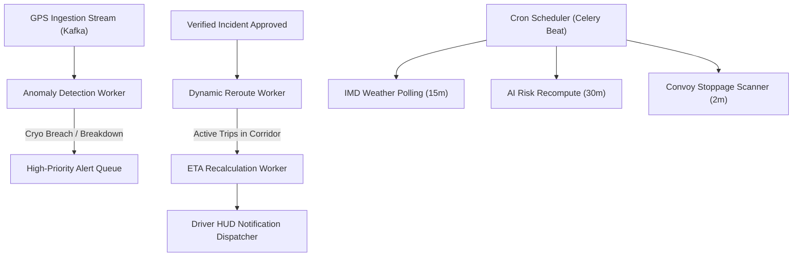

# NER-LogiSense: Background Jobs & Event-Driven Workflow Design

## 1. Architecture Overview
NER-LogiSense relies on an asynchronous background job processing framework powered by **Celery + Redis** (or **BullMQ** for Node microservices) and **Kafka / Redpanda** event streams.

This isolates long-running analytical computations, batch I/O, and external API polling from the real-time request-response loop.

---

## 2. Event-Driven Workflow Pipeline



---

## 3. Scheduled Periodic Jobs (Celery Beat)

| Job Name | Schedule | Target Queue | Task Description |
| :--- | :--- | :--- | :--- |
| `poll_imd_weather_network` | Every 15 mins | `weather_tasks` | Fetches precipitation and wind metrics across 482 AWS stations; triggers risk model on $>50\text{mm}$ surges. |
| `recompute_ai_disruption_risks` | Every 30 mins | `ml_tasks` | Runs batch inference across 1,840 road segments; updates probability and severity in `risk_scores`. |
| `scan_convoy_prolonged_dwell` | Every 2 mins | `telemetry_tasks` | Scans active vehicles with speed $< 2\text{ km/h}$ for $>25$ minutes outside authorized depots. |
| `check_cryo_cold_chain` | Every 30 secs | `critical_tasks` | Audits temperature sensor streams for vaccine and liquid oxygen consignments; alerts dispatcher on breach. |
| `expire_stale_alerts` | Hourly | `maintenance_tasks` | Moves resolved alerts past `expires_at` to archived state. |
| `partition_maintenance` | Daily @ 02:00 | `db_tasks` | Pre-creates next month's `gps_readings` PostGIS partition table. |

---

## 4. Failure Recovery & Dead Letter Queues (DLQ)
- Tasks are configured with exponential backoff:
  ```python
  @celery_app.task(bind=True, max_retries=5, default_retry_delay=10)
  def dispatch_sms_alert(self, phone, message):
      try:
          sms_gateway.send(phone, message)
      except ExternalGatewayException as exc:
          raise self.retry(exc=exc, countdown=2 ** self.request.retries)
  ```
- Unrecoverable failures move to `alerts.dlq` for operator investigation without blocking concurrent event processing.
