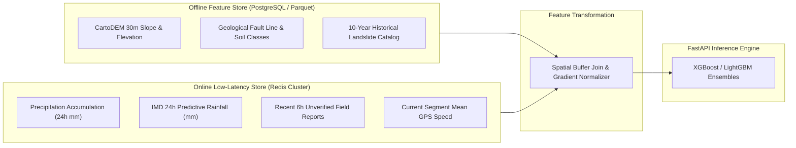

# NER-LogiSense: Machine Learning Architecture & Feature Store Specification

## 1. Problem Framing
The AI Disruption Prediction module predicts the probabilistic likelihood of transportation failure for road segments in the North Eastern Himalayan and Barak/Brahmaputra basin terrain over forward time horizons ($+6\text{h}$, $+12\text{h}$, $+24\text{h}$, $+48\text{h}$).

### Target Labels
- **Binary Hazard:** Disrupted ($y \in \{0, 1\}$)
- **Multi-Class Failure Mode:**
  1. $0$: Nominal Open
  2. $1$: Landslide / Debris Fall
  3. $2$: Flash Flood / Road Inundation
  4. $3$: Structural Bridge Load Restriction
  5. $4$: Monsoon Mudflow Congestion

---

## 2. Feature Store Architecture



### Feature Dictionary

| Feature Name | Type | Source | Update Cadence | Description |
| :--- | :--- | :--- | :--- | :--- |
| `slope_angle_deg` | Float | CartoDEM | Static | Mean slope angle of the mountain cut |
| `elevation_m` | Float | CartoDEM | Static | Altitude above sea level |
| `soil_instability_idx` | Float | Geological Survey | Static | Categorical embedding $[0.20 - 0.95]$ |
| `historical_incidents` | Int | Internal Catalog | Monthly | Total past landslides within 500m buffer |
| `rainfall_accum_24h` | Float | IMD AWS Network | 15 mins | Accumulated millimeter rainfall in catchment |
| `rainfall_pred_24h` | Float | IMD WRF Model | 6 hours | Forward forecast rain |
| `recent_field_reports`| Int | Mobile Sync Queue | Real-time | Ground truth reports submitted in last 4 hours |
| `drainage_deficit` | Float | Topographic Index | Static | Low-lying accumulation risk ($1.0 - \text{drainage}$) |

---

## 3. Model Architecture & Ensembling

The primary inference engine runs a stacked ensemble:
1. **LightGBM Classifier:** Fast gradient booster handling sparse categorical features and missing weather station inputs.
2. **XGBoost Classifier:** Calibrated using Isotonic Regression to output reliable posterior probabilities $P(\text{landslide} \mid X)$.

### Hyperparameters
```python
model_params = {
    "objective": "binary:logistic",
    "eval_metric": "aucpr",
    "learning_rate": 0.04,
    "max_depth": 6,
    "min_child_weight": 4,
    "subsample": 0.85,
    "colsample_bytree": 0.80,
    "scale_pos_weight": 4.5 # Addresses class imbalance of landslide events
}
```

---

## 4. Retraining Pipeline (MLOps)
- **Orchestration:** Airflow / Kubeflow periodic pipeline executing weekly or triggered when $>20$ newly verified field incident reports arrive.
- **Drift Detection:** Evidently AI evaluates population stability index (PSI) on weather feature distributions.
- **Model Registry:** MLflow tracks experiment runs, model artifacts, ROC-AUC, and F1 scores. A new candidate model must outperform champion model PR-AUC by $>1.5\%$ on out-of-time validation folds before canary deployment.

---

## 5. Inference API & Performance SLAs
- **Inference Latency:** $< 35\text{ ms}$ for single segment evaluation; $< 180\text{ ms}$ for entire corridor batch (50 segments).
- **Fallback Rule:** If ML model service encounters timeout or memory constraint, deterministic physical slope-water thresholds immediately return conservative hazard predictions.
