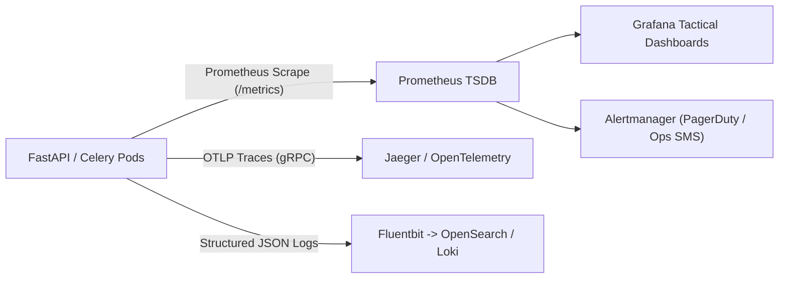

# NER-LogiSense: Monitoring, Logging, Alerting & Backup Strategy

## 1. Observability Architecture
Given the mission-critical nature of emergency supply corridors and medical cold-chains, NER-LogiSense operates with comprehensive observability across metrics, distributed traces, and structured logs.



---

## 2. Core Prometheus Metrics

| Metric Name | Type | Description | Target SLA |
| :--- | :--- | :--- | :--- |
| `http_requests_total` | Counter | Total HTTP requests by path, status, and method | - |
| `http_request_duration_seconds` | Histogram | Request latency distribution | p95 < 200ms |
| `gps_ingestion_throughput_per_sec`| Gauge | Live telematics points ingested per second | > 5,000 pts/sec |
| `active_websocket_connections` | Gauge | Active operators connected to live telemetry stream | - |
| `cryo_temperature_breach_total` | Counter | Number of cryogenic cold-chain threshold violations | 0 |
| `offline_sync_conflict_count` | Counter | Number of sync items requiring human verification | - |
| `route_planning_duration_seconds`| Histogram | Time-dependent A* route calculation latency | p95 < 800ms |

---

## 3. Structured Logging Standard
All microservices emit structured JSON to stdout with standardized trace context:
```json
{
  "timestamp": "2026-10-03T14:42:01.124Z",
  "level": "INFO",
  "service": "route-optimization-service",
  "trace_id": "c49a8f2190bb12ad",
  "span_id": "781a9f02bb31c944",
  "user_id": "Col. R. Saikia",
  "action": "ROUTE_PLAN",
  "origin": "Guwahati Central Depot",
  "destination": "Silchar Relief Camp",
  "selected_option": "A",
  "duration_ms": 142.6,
  "client_ip": "10.244.2.14"
}
```

---

## 4. Disaster Recovery & Backup Strategy

### 4.1. PostgreSQL + PostGIS Continuous Archival
- **Write-Ahead Log (WAL) Archiving:** WAL files are streamed continuously to an S3-compatible cold bucket every 60 seconds (`pgBackRest` / `WAL-G`).
- **Full Daily Snapshot:** Complete physical snapshot generated every night at 02:00 IST with AES-256 encryption.
- **Recovery Objectives:**
  - **Recovery Point Objective (RPO):** $< 5\text{ minutes}$ (loss of at most 5 minutes of non-telemetry state).
  - **Recovery Time Objective (RTO):** $< 30\text{ minutes}$ for complete cluster stand-up.

### 4.2. Media & Asset Storage Backups
- Geo-tagged field damage photos and digital signatures stored in primary S3 bucket are replicated across regions with Cross-Region Replication (CRR) and Object Lock (WORM compliance).
