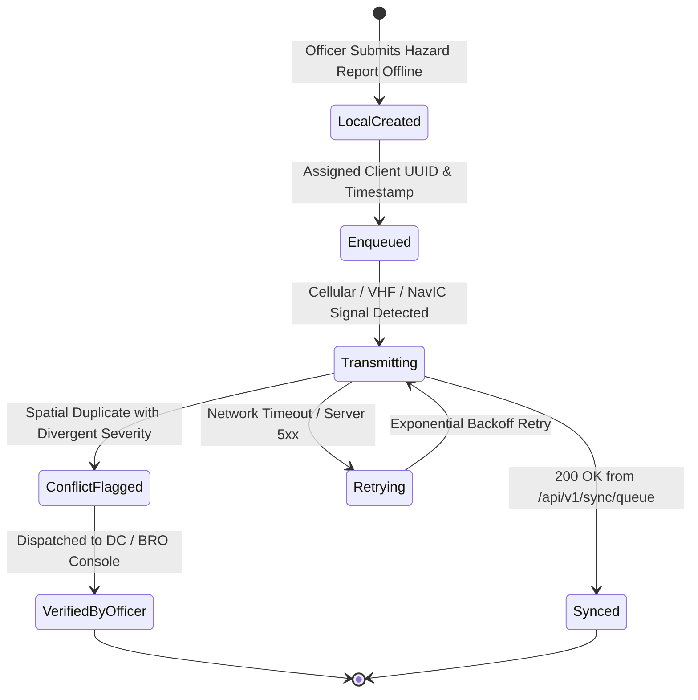

# NER-LogiSense: Offline Synchronization Protocol

## 1. Overview & Constraints
In the North Eastern Region of India, logistical operations regularly traverse valleys and hill sections without cellular connectivity (e.g. NH-27 between Lumding and Jatinga, NH-6 through the Sonapur gorge, and eastern Mizoram corridors).
NER-LogiSense employs a strict **Offline-First Architecture** ensuring uninterrupted incident reporting, offline navigation, and telematics buffering.

---

## 2. On-Device Storage & Queue Structure
The mobile client (Flutter / Android / PWA) maintains an encrypted on-device SQLite database with an **Append-Only Sync Queue**.



### Sync Queue Item Schema
```json
{
  "queue_id": "local_q_88921",
  "client_uuid": "550e8400-e29b-41d4-a716-446655440000",
  "operation": "CREATE_FIELD_REPORT",
  "payload": {
    "lat": 25.1882,
    "lon": 92.9976,
    "accuracy_m": 1.8,
    "disruption_type": "Landslide",
    "severity": "CRITICAL",
    "description": "Culvert 14 washed out under heavy monsoon rain",
    "media_files": ["local_storage://img_304.jpg"]
  },
  "client_timestamp": "2026-10-03T14:15:00Z",
  "device_id": "RUGGED-FIELD-TAB-AS04",
  "retry_count": 0
}
```

---

## 3. Conflict Resolution Strategy

| Entity Type | Conflict Scenario | Resolution Policy |
| :--- | :--- | :--- |
| **Field Reports** | Two officers submit conflicting reports for the same segment (e.g. "Road Blocked" vs "Single Lane Open") within 2 hours. | **Multi-Version Preservation:** Server accepts both records, preserves both UUIDs, links them to the same incident ID, and flags the incident as `CONFLICT_FLAGGED` for priority review by the District Officer or BRO Commander. |
| **Road Status Updates** | Mobile client submits a status transition that conflicts with a newer official headquarters update. | **Official Verification Precedence:** Latest official verified update is preserved as the current state, while client update is appended to `road_status_events` with an audit log trail. |
| **GPS Telemetry** | Historical batch points arrive out-of-order after 4 hours of network blackout. | **Chronological Insertion:** Server ingests points ordered by GNSS hardware timestamp, backfilling the trip trajectory in TimescaleDB without overwriting the latest real-time vehicle position if newer coordinates are already recorded. |

---

## 4. Delta Synchronization (`/api/v1/sync/delta`)
To preserve scarce cellular data on 2G/EDGE networks:
- The client passes a high-water mark timestamp `last_synced_at`.
- The server responds with only updated records modified since that cursor:
```http
GET /api/v1/sync/delta?last_synced_at=2026-10-03T13:00:00Z&district=dima-hasao
```
- Payload uses gzip compression, minimizing payload size to $< 8\text{ KB}$ for regional updates.

---

## 5. Media Compression & Resumable Upload
- Field photos are compressed on-device using WebP/JPEG format to a maximum file size of $400\text{ KB}$ and max dimension of $1920\times 1080\text{ px}$.
- Direct upload uses S3 presigned PUT URLs with SHA-256 integrity verification.
- Failed media uploads retry safely without re-submitting the textual report.
